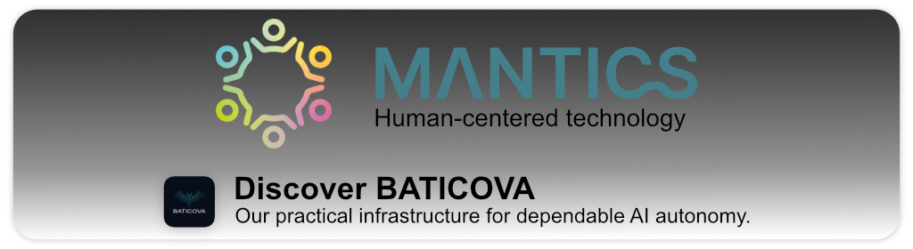

<!-- Banner (add profile/banner.png in this repo) -->

  

<h1 align="center">👋 Mantics</h1>

  We build human-centered technology — with clarity, craftsmanship, and care.

  
  
  
  

---

## What we’re building

### 🧠 Baticova — dependable AI autonomy
**Baticova** turns AI from isolated tools into **digital departments** that can plan, coordinate, and deliver real work — **transparently and under human control**.  
It’s practical infrastructure for dependable autonomy, shaped by our belief that technology should amplify human collaboration, not replace it.

- **Why it matters:** Today’s AI is powerful but static; it still needs people to manage every step.  
- **Our approach:** transparency, memory, and governance — the three foundations for trustworthy autonomy.  
- **Where it runs:** locally on your device or securely in the cloud.

➡️ Learn more: **[baticova.com](https://baticova.com)**

---

## How we work

- **Human-centered by design.** Clear UX, calm typography, and thoughtful systems.
- **Open when it helps.** We share research, tools, and docs as they mature.
- **Production-minded.** Demos are great — but we ship things you can actually use.

---

## Get involved

- 💬 **Chat:** Join our GitHub Discussions to share ideas and feedback.
- 🧪 **Early access:** Watch this org for updates; we’ll open pilots as they’re ready.
- ❤️ **Support:** Back our work via GitHub Sponsors.

---

  Made by <a href="https://mantics.eu/">Mantics</a> · A project by humans who care about how technology works with people.

